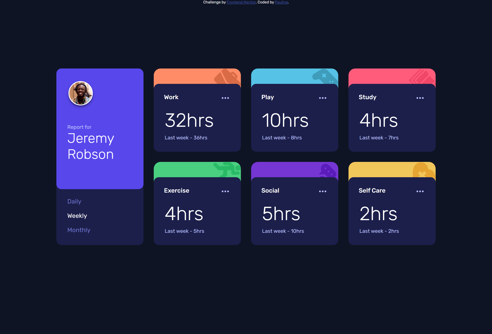

# Frontend Mentor - Time tracking dashboard solution

This is a solution to the [Time tracking dashboard challenge on Frontend Mentor](https://www.frontendmentor.io/challenges/time-tracking-dashboard-UIQ7167Jw). Frontend Mentor challenges help you improve your coding skills by building realistic projects. 

## The challenge

Your users should be able to:

- View the optimal layout for the site depending on their device's screen size
- See hover states for all interactive elements on the page
- Switch between viewing Daily, Weekly, and Monthly stats

### Screenshot

### Links

- Live Site URL: [Time Tracking Dashboard](https://testerium-time-tracking-dashboard.netlify.app/)

## My process

Implementation of project took me 11h. I have completed the mobile and desktop views. The JavaScript aspect took me the most time, but in the end it finished succesfully. For the future some functions can definitely be shortened to optimalize the code.

### Built with

- HTML
- CSS 
- SCSS
- Grid
- Flexbox
- JavaScript

## Author

- Frontend Mentor - [@testerium](https://www.frontendmentor.io/profile/testerium)
